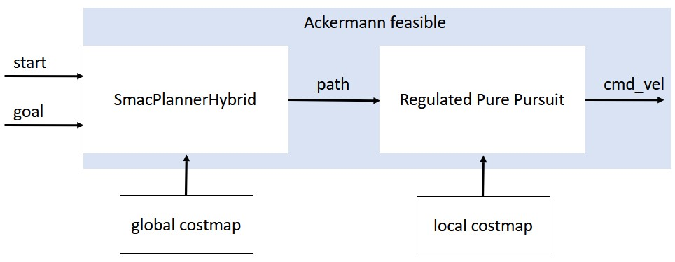
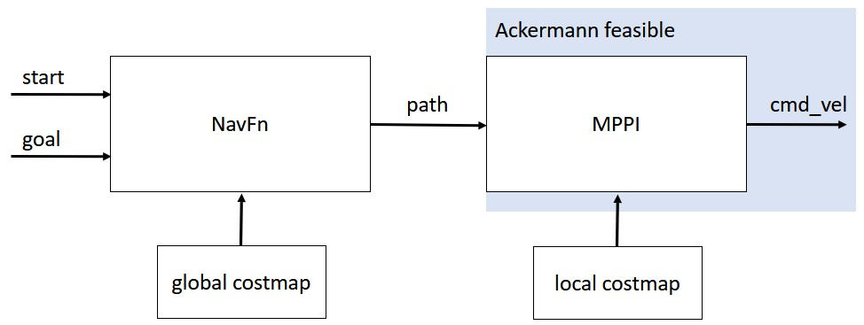

# TAS2-Software


## Overview

The TAS2-Software stack serves as a simulation environment for the TAS car and its associated hardware as well. The software stack is based on ROS2 humble.


## Getting Started
The TAS2-Software is designed using ROS2 and tested for Ubuntu 22.04. Follow these steps to install ROS2 and setup the workspace.

### Install ROS2

Check the [official ROS2 installation guidelines](https://docs.ros.org/en/humble/Installation/Ubuntu-Install-Debians.html) for detailed instructions on installing ROS2 on your system.

### Install necessary packages

Install the additional packages needed for the TAS2-Software.

- Install the colcon:

  ```bash
  sudo apt install python3-colcon-common-extensions 
  ```


- Install extra packages:

  ```bash
    sudo apt install ros-humble-rqt*
    sudo apt-get install ros-humble-gazebo-ros2-control
    sudo apt install ros-humble-joint-state-publisher
    sudo apt install ros-humble-joint-state-publisher-gui
    sudo apt install ros-humble-xacro
    sudo apt install ros-humble-gazebo-ros-pkgs
    sudo apt install ros-humble-nav2-bringup
    sudo apt install ros-humble-navigation2
    sudo apt install ros-humble-robot-localization
    sudo apt install ros-humble-ackermann-msgs
    sudo apt install ros-humble-ros2-control
    sudo apt install ros-humble-ros2-controllers
    sudo apt install ros-humble-slam-toolbox
    sudo apt-get install ros-humble-tf2-tools 
    sudo apt-get install ros-humble-tf-transformations
    sudo apt-get install ros-humble-nav2-smac-planner
    sudo apt install ros-humble-navigation2
    sudo apt install ros-humble-rviz2
    sudo apt install ros-humble-laser-proc
    sudo apt install python3-pip  
    pip3 install transforms3d
    pip3 install pyserial
   ```
   
### Clone the repository

Now clone this repository.

- Before proceeding with the clone, please ensure that your SSH key is correctly set up on GitLab. 

### Recommended Workspace Structure

To ensure a smooth experience with the TAS2 software stacl, it's recommended to set up your workspace with the following structure. Please check whether your workspace looks like this:

- [Home]
  - [TAS2-Software] - The name of the workspace
    -  [hardware] - Source code related to ESP for low level actuation
    -  [src] - Workspace source folder for ROS packages
        - [tas_hardware] - Provides nodes for the simulator and hardware related to ackermann drive
        - [tas2] - Main package for TAS2 simulator and hardware operation
        - [Other packages] - Some addditional packages directories
    -  [README.md] - Instruction to make your life easier

### Source your workspace

  ```bash
  echo "source /usr/share/colcon_cd/function/colcon_cd.sh" >> ~/.bashrc
  echo "export _colcon_cd_root=/opt/ros/humble/" >> ~/.bashrc
  ```

### Now build the workspace. 
- Use the following command in the cloned repository directory

  ```bash
  colcon build --symlink-install
  ```
#### DEBUG: Verify the following source information in your .bashrc file if there are issues in Workspace building
  ```
  source /opt/ros/humble/setup.bash
  source ~/tas-2-software/install/setup.bash
  source /usr/share/colcon_cd/function/colcon_cd.sh
  source /usr/share/colcon_argcomplete/hook/colcon-argcomplete.bash
  export _colcon_cd_root=/opt/ros/humble/
  source /usr/share/gazebo-11/setup.sh

  export ROS_DOMAIN_ID= "Tas car id"
  export ROS_LOCALHOST_ONLY=0
  ```


## TAS2-Simulator (Gazebo) and RViz Usage Guide
This guide will walk you through launching and utilizing the TAS2-Simulator using Gazebo and RViz, providing manual control and enabling automatic driving for the TAS Car. 

🚗 Starting the Simulator:


```bash
ros2 launch tas2 simulation.launch.py
```
After launching the simulation, you'll see two applications: Gazebo and RViz. You might encounter errors in RViz. Don't worry; these will be resolved in the next few steps.

- Gazebo: Think of it as a virtual playground for testing robots and machines before building them in the real world. (https://gazebosim.org/home)

- RViz: Imagine it as a magic window showing you what your robot 'thinks' and 'sees.' It helps you visualize sensor data and make real-time adjustments to your robot's behavior. (http://wiki.ros.org/rviz)


🕹️ Manual Control:

In rviz, set the fixed frame as "odom". Now run the following command in a seperate window

```bash
ros2 run teleop_twist_keyboard teleop_twist_keyboard
```

Now, you could drive the TAS Car by pressing the keyboard. All keyboard control instructions, e.g. change direction and velocity could be found in the terminal. 


🚀 Enabling Automatic Driving:


- Use "ctrl + c" to kill the teleop_twist_keyboard
- Make sure that you have changed fixed frame in rviz to map


🌟 Starting Navigation:

In a second terminal, run the following command

```bash
ros2 launch tas2 navigation.launch.py
```


📍 Navigating to the Goal:

To navigate to a goal:
1. Click the 2D Goal Pose button in RViz.
2. In RViz, click to specify your desired destination.

Remember, keep the "map" as your global frame in RViz, otherwise navigation will fail during moving. 

## TAS2-Hardware Setup and Autonomous Navigation
Here's a step-by-step guide for transitioning to TAS2-Hardware and configuring autonomous navigation using NAV2.

- Connect to the TAS Car's WiFi network using the following command
```bash
ssh CAR_NAME@IP_ADDRESS_OF_CAR_PC
```
Enter the  password when prompted: WILL_BE_PROVIDED_TO_GROUPS

- Launch the hardware components on the TAS-Car computer by running:

```bash
ros2 launch tas2 hardware_nuc.launch.py
```

- Launch Hardware Components on Your Desktop PC:
To receive sensor data from the TAS-Car, launch the hardware components on your PC using

```bash
ros2 launch tas2 hardware_computer.launch.py
```

- Start Navigation for the Hardware

```bash
ros2 launch tas2 hardware_navigation.launch.py
```


## Useful Info

#### Launch files

The project contains different launch files to start different functionalities. Due to limitations in our PC's computational power, we have separated 'simulation.launch.py' and 'navigation.launch.py' for individual execution.

#### Tool: RQT

The ROS framework provides various tools. Among them is the visualization program RQT, with different plug-ins. All available packages can be installed with the terminal command:

  ```bash
    sudo apt install ros-humble-rqt*
   ```
At the first start, use the command

  ```bash
    rqt --force-discover 
   ```
to load all available plug-ins. After that, you can start RQT with the simple command

  ```bash
    rqt
   ```

Useful rqt-plugins are:
- TF Tree
- Topic Monitor
- Node Graph 


#### Configuring [NAV2](https://navigation.ros.org/)

To offer fully autonomous navigation, NAV2 uses the following concepts:

- **Behavior Trees** For task planning, a behavior tree defining different tasks and behaviors in a tree structure.

- **Costmap** The costmap is a represantation of the surrounding environment is composed of different layers.

- **Odometry** The transformation between the car’s base frame and the odometry is provided by a localization module.

- **Planner** The planner continuosly searches for a valid path between the current position of the car and a provided goal state.

- **Controller** The controller generates a feasible trajectory to locally follow the planned path.

- **Smoother** Smoothing can be applied to refine unsteady trajectories.

In the following, we give our tuning advice for the various components of NAV2.

- Behavior trees

For navigating around, we use the adaptions of the nav2 behavior trees `navigate_to_pose_w_replanning_and_recovery` and `navigate_through_poses_w_replanning_and_recovery` that will continuously replan the path to the goal while driving and trigger recovery actions if replanning fails. We adapted the tree, such that it is suitable for Ackermann vehicles. The behavior tree can be edited in the file `config/my_nav_to_pose_bt.xml`.

Other predesigned behavior trees offered by NAV2 can be found in the package `nav2_bt_navigator`.

- Costmap

There exist two costmaps in NAV2, the local costmap, used by the controller and the global costmap, used by the planner.

If you find the robot colliding with obstacles, a retuning of the costmap may be necessary. This can be done in the config file `navigation.yaml`. We recommend to tune the inflation layer as described in the [NAV2 tuning guide](https://navigation.ros.org/tuning/index.html). Also, we recommend to use the robot's footprint as a collision model. It may be necessary to adapt the footprint values, therefore please check the resulting footprint under the `/footprint` topic in RViz.

- Odometry

Robot odometry is currently published by the node `tas_simulation` from the package `tas_hardware` in the simulation. In the hardware case, the odometry is published by the node `tas_hardware`.

- Planner and Controller

We use two different planning pipelines to offer Ackermann-feasible trajectories.



In the first pipeline, we use the SmacPlannerHybrid and the Regulated Pure Pursuit controller. The idea of this pipeline is to find a global path which is feasible for Ackermann vehicles. By using the Regulated Pure Pursuit controller, the local trajectory follows the global Ackermann-feasible path. As the Hybrid A* is able to generate near-optimal global paths, we expect a good overall performance from this planner.



In the second pipeline, we use the NavFn planner and the MPPI controller. The NavFn planner here creates a path which is not feasible for Ackermann drive. However, this path connects start and goal and is collision-free. The MPPI controller follows this part, but takes the Ackermann drive into account. As the Ackermann drive is only considered during the local optimisation, we expect the resulting trajectory not necessarily to be near the global optimum. Nevertheless, due to the usage of the MPPI controller, we expect a good maneuverability when it comes to difficult situations.

Both planning pipelines can be chosen by setting the `FollowPath` and the `GridBased` parameter in `navigation.yaml` to the desired planner/controller.

For usage with the real TAS car, it might be necessary to tune some of the parameters. In particular, it may be necessary to increase the minimum turning radius and the MPPI motion model must be set to Ackermann.


## Additional Considerations:
### Smoother

For the simulation setup, the effect of smoothing can not really be measured as the simulation by itsself introduces here some bias. We recommend to check smoothing when working on the real TAS car.

### Resources on the web

Explore tutorials and resources for NAV2 to fine-tune and customize your navigation setup.

#### Tutorial of NAV2

First-Time Robot Setup Guide from the official NAV2 site:

[https://navigation.ros.org/setup_guides/index.html](https://navigation.ros.org/setup_guides/index.html)

Associated Git repository:

[https://github.com/ros-planning/navigation2_tutorials/tree/master/sam_bot_description](https://github.com/ros-planning/navigation2_tutorials/tree/master/sam_bot_description)

#### Video Tutorial from Josh Newans

Youtube Playlist: how to implement a mobile robot in ROS2 (foxy):

[https://www.youtube.com/playlist?list=PLunhqkrRNRhYAffV8JDiFOatQXuU-NnxT](https://www.youtube.com/playlist?list=PLunhqkrRNRhYAffV8JDiFOatQXuU-NnxT)

Youtube Playlist: how to get started with ROS (general introduction not only mobile robots)

[https://www.youtube.com/playlist?list=PLunhqkrRNRhYYCaSTVP-qJnyUPkTxJnBt](https://www.youtube.com/playlist?list=PLunhqkrRNRhYYCaSTVP-qJnyUPkTxJnBt)

Blog of the mobile robot implementation:

[https://articulatedrobotics.xyz/mobile-robot-full-list/](https://articulatedrobotics.xyz/mobile-robot-full-list/)

Associated Git repository:

[https://github.com/joshnewans/articubot_one](https://github.com/joshnewans/articubot_one)
